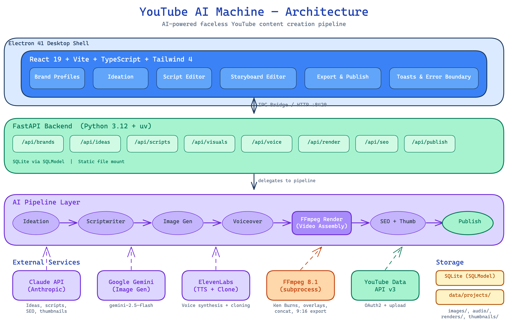

# Headless Hero

**A desktop app that turns a single topic into a finished, publish-ready YouTube video — script, illustrations, voiceover, and rendered video — in one integrated pipeline.**

Instead of stitching together ChatGPT, ElevenLabs, Midjourney, a video editor, and Canva by hand, Headless Hero runs the entire faceless-content workflow end to end inside one application, with brand consistency enforced at every step.



---

## Overview

Producing educational YouTube content normally means juggling half a dozen tools and manually carrying assets between them. Headless Hero collapses that into a single Electron app backed by an AI orchestration pipeline:

**Idea → Script → Timeline → Images → Voiceover → Effects → Render → Thumbnail & SEO → Publish**

Every stage is AI-assisted but fully editable, and the output is a 1920×1080 MP4 rendered frame-by-frame with captions, camera effects, transitions, and an optional recurring animated host.

## Key Features

- **AI scriptwriting** with a segmented narrative arc, hooks, title cards, and a coherent visual storyboard across scenes.
- **Per-scene image generation** (Google Gemini) with multiple visual modes — full-frame, multi-frame progressions, comparison boards, stat cards, and layered cutout animations.
- **Voice synthesis & cloning** (ElevenLabs), where generated audio duration becomes the single source of truth for scene timing.
- **Frame-accurate video rendering** via a Remotion composition — kinetic captions, camera drift/zoom, native transitions, and subtitle styling, all driven by data rather than a manual editor.
- **Lane-based timeline editor** with split/merge, a per-scene micro-timeline, and live preview.
- **One-click thumbnail + SEO generation** and **direct YouTube upload** over OAuth2.
- **Built-in dev dashboard** — live log streaming, render-job monitoring, an API explorer, a read-only DB browser, and per-service API cost tracking.

## Tech Stack

| Layer | Technology |
|-------|-----------|
| **Desktop shell** | Electron 41 (IPC bridge to a local backend) |
| **Frontend** | React 19, TypeScript, Vite, Tailwind 4 |
| **Backend** | Python 3.12, FastAPI, SQLModel / SQLite, `uv` |
| **Rendering** | Remotion 4 (React frame-by-frame), FFmpeg (audio) |
| **AI services** | Claude / OpenAI / local Ollama (routed per task), Google Gemini (images), ElevenLabs (voice), Runway / fal (AI video) |

## Architecture Highlights

A few pieces I'm particularly happy with:

- **Data-driven video rendering.** The whole video is one Remotion composition built from a JSON scene graph the Python pipeline emits — enabling a global timeline, native transitions, and deterministic re-renders without a manual NLE. Camera moves are computed from a per-frame "safe envelope" so a panning photo can never expose the background.
- **Audio-duration-as-timing-truth.** Scene lengths derive from the actual generated voiceover, so narration and visuals stay locked in sync automatically.
- **Pluggable LLM routing.** Each task (ideation, scripting, SEO, classification, FX) is routed to the best-fit provider and reasoning effort, configurable from the UI.
- **Content-addressed caching.** Image generation and scene rendering skip work when inputs are unchanged (prompt marker files + mtime comparison), making iteration cheap.
- **Clean module boundaries.** FastAPI routers only validate and delegate; business logic lives in a framework-free `pipeline/` layer; external APIs are isolated behind thin `integrations/` wrappers.

```
electron/     Main process + IPC preload bridge
frontend/     React 19 + TS + Tailwind UI (dashboard, editor, timeline, settings)
backend/
  api/          FastAPI routers (validation + delegation)
  pipeline/     AI orchestration & business logic (no web framework)
  integrations/ Thin external-API wrappers (Claude, Gemini, ElevenLabs, YouTube)
  models/       SQLModel tables + Pydantic schemas
remotion/     Remotion rendering project (scenes, effects, transitions)
```

## Running Locally

**Prerequisites:** Node.js 18+, Python 3.12+, [`uv`](https://docs.astral.sh/uv/), FFmpeg 8+.

```bash
git clone https://github.com/alecgrater/headless-hero.git
cd headless-hero

# API keys (see docs/SETUP.md for details)
export ANTHROPIC_API_KEY="..."      # or OPENAI_API_KEY
export GOOGLE_AI_KEY="..."          # image generation
export ELEVENLABS_API_KEY="..."     # voiceover
# Optional — YouTube publishing:
# export GOOGLE_CLIENT_ID="..." GOOGLE_CLIENT_SECRET="..."

npm install
cd backend && uv sync && cd ..
cd frontend && npm install && cd ..

npm run dev   # backend (:8420) + frontend (:5173) + Electron
```

The dev dashboard is available at `http://127.0.0.1:8420/dev/` while the backend is running. See [docs/SETUP.md](docs/SETUP.md) for obtaining API keys and configuring YouTube OAuth.

## Status

A personal project built to explore end-to-end AI media pipelines and desktop app architecture. It is functional across the full workflow and under active iteration.

## License

ISC
